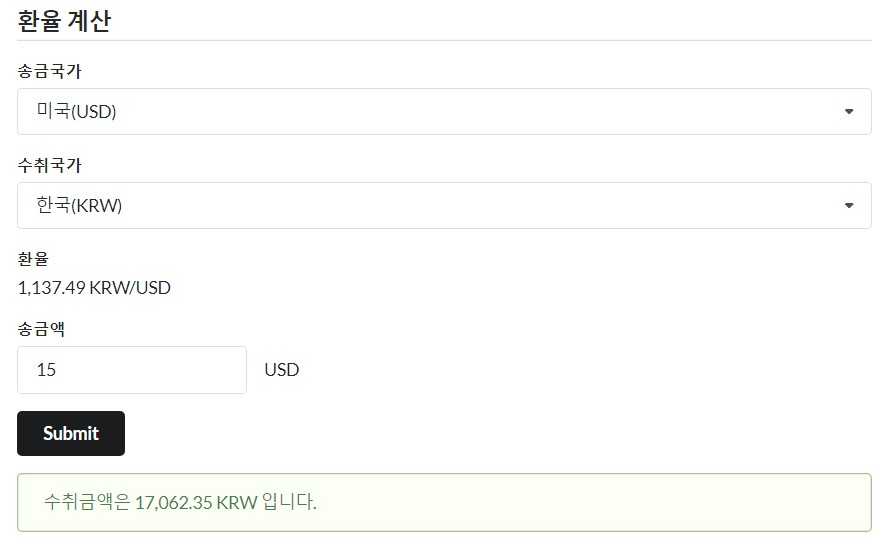

# currency-calculation
simple currency calculation application - 환율 계산

## 시연 화면

## 설계 방향

   1. 돈(환율)과 관련한 애플리케이션이다 보니, **최대한 정확한 정보**를 가져오는 것이 중요하다고 판단하여 **매 요청시마다 환율정보**를 가져오는 방향으로 설계했습니다.
   
   2. 다만, **외부 API를 사용해야 하니 API사용을 효율적**으로 해야 한다고 생각했습니다. Free Plan에 경우는 한시간에 한번만 새로운 정보를 업데이트하니, **실제로 API를 사용하는건 한시간에 최대 한번씩만** 진행합니다. 한시간 동안 여러요청이 와도 기존에 가져왔던 환율 정보를 반환합니다.
    
   3. Free Plan이 아닌 다른 Plan으로 변경되는 경우를 고려하여서, properties에 업데이트 주기 시간을 명시하였습니다. 현재는 Free Plan의 업데이트 주기인 3600초로 설정하였고, **이후에 Plan이 바뀌어도 properties의 해당 옵션만 변경하여 유연하게 대처 할 수 있도록** 설계했습니다.
    
   4. **추후에 외부 API를 다른 API로 변동하거나, 환율정보 계산을 담당하는 로직이 변동 될 수 있는 사항을 고려**하여 서비스를 둘로 나누었고 각 서비스들을 인터페이스를 통해 의존하게 하여 **결합도를 낮추는 방향**으로 설계 하였습니다. 
    
   5. 송금국가가 source로 사용된 USD가 아닌 다른 국가(AUD)의 통화인 경우에는 source를 변동하지 않고, 간단한 연산을 통해 해결하였습니다. 예를 들어, **KRW / AUD에 경우는 (KRW / USD)  / (AUD / USD)로 계산**하였습니다.
